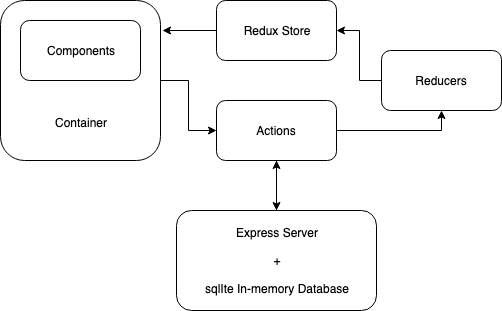

#  Signafire Internship Interview Challenge

This is a Signafire Internship Challenge created by ***Geon Yoon***. Since I am a **full-stack**, I programmed both the frontend and the backend.  I could have created the application more straightforwardly so that I can decrease the number of HTTP requests and the size of the codes. However, my focus was on how to develop the application in a well-organized way so that this application can be expanded quickly in the real world scenario and modified efficiently. I emphasize separating the functionality of a program into independent, interchangeable modules, such that each contains everything necessary to execute only one aspect of the desired functionality.



*This is an overview of the application.*

## Extra Assumptions I made

#### Frontend
- If the user deletes the starred message, the length of the starred item is be decreased. 
- After the user deletes the messages, they cannot undo it. Trash buttons do not appear on the deleted messages.
- You cannot highlight any texts on trashed messages.
- When the user refreshes the page:
    - Messages become unsorted.
    - All the highlights disappear.

#### Backend

- The database is last until the backend server is running. Since I used the In-memory database, the database is reset when the server is restarted or shut down. Therefore, all the changes made by the user in the frontend does not disappear as long as the server is running.
- When the message is clicked to be starred(unstarred) or trashed, the server only sends the modified message so that the frontend updates one message instead of updating entire messages.
- The backend does text highlighting. The frontend only renders the messages. 

## How To install
Clone the repository and get inside of the root directory.
```
git clone git@github.com:GeonYoon/Internship-challenge.git
cd Internship-challenge
```

### Backend Installation 
Get into the backend directory and install all the dependencies before you run the server.
```
cd backend
npm install
npm start
```

### Frontend Installation
Get into the frontend directory and install all the dependencies before you run the server.
```
cd frontend
npm install
npm run dev
```


## Built With
* [React](https://reactjs.org/) - Used to build client side
* [Redux](http://redux.js.org/docs/basics/UsageWithReact.html) - Predictable state container for JavaScript apps
* [Node.js](https://nodejs.org/en/) - Used to build client side 
* [Express.js](http://expressjs.com/) - Framework for Node.js
* [Axios](https://github.com/axios/axios) - Promise based HTTP client for the browser and node.js

## Authors
* **Geon Yoon ** - *Initial work* - [GeonYoon](https://github.com/GeonYoon)
